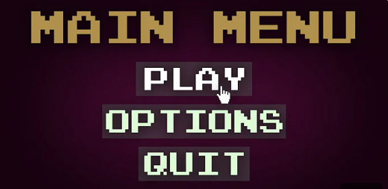
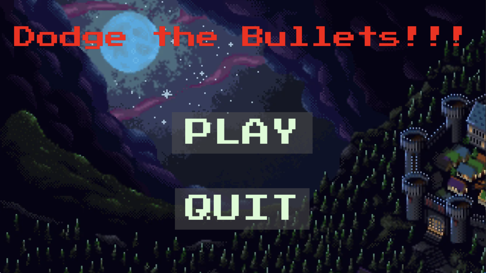

# Bullet Hell
## CS110 Final Project Spring, 2024 

## Team Members
Leon Jiang 

***

## Project Description
My project is a game where you have to dodge all the bullets being fired at you. To beat the game, you need to survive for 15 seconds, then the hero will tell a dad joke to scare the monsters away.

***   

## GUI Design

### Initial Design

### Final Design

## Program Design

### Features

1. moveable character with arrow keys and space bar 
2. gave over and winning screen
3. start menu
4. enemies shooting at the playable character
5. scrolling background

### Additional Modules
Math: https://docs.python.org/3/library/math.html

### Classes

- Button 
Represents a clickable button on the screen. It can display either an image or text, change color when hovered over, and detect mouse clicks within its area
- Hero
Handles the movement, jumping, direction facing, and drawing of the hero sprite on the screen.
- Enemy
Represents the enemy entities in the game. Each enemy has its own movement pattern, shooting behavior, and collision detection with the player. 
- Bullet
Represents the bullets fired by enemies in the game. It moves across the screen, detects collisions with the player, and gets removed when it goes off the screen.
- Game
Manages the game state, including the player, enemies, background scrolling, and drawing everything on the screen. It initializes the game environment and updates it in the game loop.
-Controller
Controls the main loop of the game. It handles user input, updates the game state, and manages transitions between different screens such as the main menu, gameplay, game over screen, and winning screen.

## ATP

| Step                 |Procedure             |Expected Results                   |
|----------------------|:--------------------:|----------------------------------:|
|  1                   | Run the Program  |Main menu screen comes with play and quit  |
|  2                   | Click play on the main menu | Game screen appears with player and enemies     |
|  3                   |Use left and right arrow keys| Player should move left and right according to the keys pressed|
|  4                   |Press the spacebar | Player should jump on the screen|
|  5                   |Get hit by bullet| Game over screen should come up with retry or quit button|
|  6                   |Click quit or retry |If you hit quit it should close the window, if you hit retry the main menu comes up again|
|  7                   |Survive for 15 seconds | The game winning screen should come up|
|  8                   |Go back to or open the main menu to test out quit button| Game window should close|
